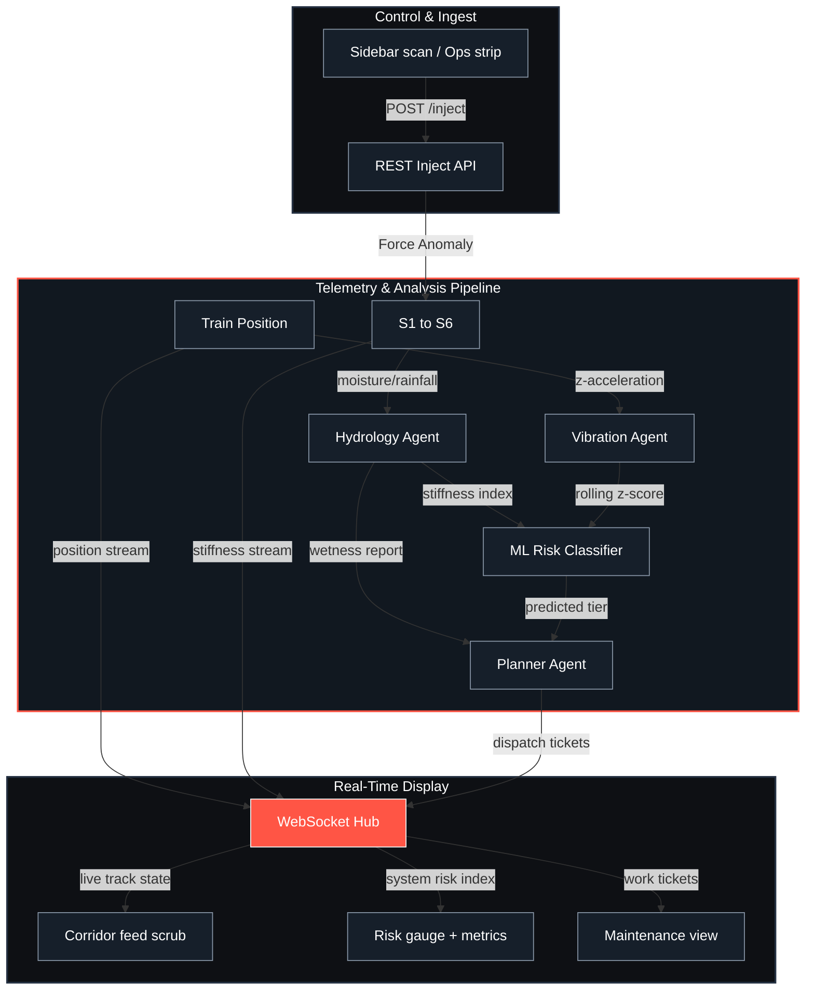

# Bogieflow

<p align="center">
  
</p>

<p align="center">
  <strong>Others monitor the rail. We monitor the ballast.</strong>
</p>

<p align="center">
  Climate-aware track-bed risk evaluation and agent-based telemetry fusion for railways.
</p>

<p align="center">
  <a href="https://bogieflow.vercel.app"><strong>▶ Live Demo</strong></a>
  &nbsp;·&nbsp;
  <a href="https://github.com/Stormynubee/Faraway2026Japan/releases">Releases</a>
</p>

<p align="center">
  <a href="https://github.com/Stormynubee/Faraway2026Japan/actions/workflows/ci.yml">
    
  </a>
  <a href="https://github.com/Stormynubee/Faraway2026Japan/blob/main/tests/">
    
  </a>
  <a href="https://github.com/Stormynubee/Faraway2026Japan/blob/main/src/lib/">
    
  </a>
  <a href="https://github.com/Stormynubee/Faraway2026Japan/releases">
    
  </a>
</p>

<p align="center">
  <a href="https://github.com/Stormynubee/Faraway2026Japan/blob/main/LICENSE">
    
  </a>
  <a href="https://www.python.org/">
    
  </a>
  <a href="https://nodejs.org/">
    
  </a>
  <a href="https://bogieflow.vercel.app">
    
  </a>
  
</p>

---

## Table of Contents
1. [Why It Matters](#why-it-matters)
2. [What It Does](#what-it-does)
3. [Screenshot Gallery](#screenshot-gallery)
4. [System Architecture](#system-architecture)
5. [Quickstart & Local Installation](#quickstart--local-installation)
6. [One-Click Deployment](#one-click-deployment)
7. [Tech Stack](#tech-stack)
8. [Project Structure](#project-structure)
9. [Verification & Testing](#verification--testing)
10. [Judging Criteria Alignment](#judging-criteria-alignment)
11. [Roadmap](#roadmap)
12. [Honesty Box](#honesty-box)

---

## Why It Matters

Monsoon rains saturate railway ballast, leading to loss of stiffness, subgrade erosion, and mud pumping under dynamic loads. Left unmonitored, this causes severe track geometry degradation and poses high risks of derailment. Because physical geometry inspection trains are run infrequently, track defects are often detected too late. 

**Bogieflow** provides a continuous, automated digital-twin evaluation framework that fuses real-time climate hydrology, rolling bogie z-axis acceleration telemetry, and a machine learning classifier to predict, prioritize, and quantify avoided railway failures.

---

## What It Does

| Feature | Description | Status |
|:---|:---|:---|
| **64-Frame Corridor Scrub** | Scroll or mousewheel-controlled high-fidelity view of the corridor. | Verified |
| **Real-time Segment HUD** | Color-coded segments S1-S6 displaying status dynamically. | Verified |
| **Multi-Agent Telemetry Fusion** | Fuses Hydrology (wetness) and Vibration (z-axis z-scores) telemetry. | Verified |
| **Quantified Avoided-Failure Impact** | Live calculations of prevented-failure cost ($USD), inspection-hours saved, and derailment risk reduction % (estimates based on active risk and open tickets). | Verified |
| **Avoided-Failure Forecasting** | Projects risk index 30 minutes ahead using step trends, exposing time-to-critical ETAs and ranked segment inspection priorities. | Verified |
| **Live Weather Toggle** | Fuses live Open-Meteo API data per segment coordinates with a 10-minute cache, falling back to simulation parameters cleanly. | Verified |
| **Explainable AI (XAI)** | Interrogates Gradient Boosting model feature importances and pulls plain-language rationales (Gemini API with offline local fallback templates). | Verified |
| **Scenario Replay & Demo** | Playbacks for Monsoon sweeps, bearing faults, or resets; client-side demo fallback when no backend WebSocket. | Verified (demo on Vercel; live REST when backend connected) |
| **Interactive Tour Coach** | Step-by-step tour guides and chatbot to explain telemetry anomalies. | Verified |

---

## Screenshot Gallery

<table width="100%">
  <tr>
    <td width="50%" align="center">
      
      <br />
      <em>Overview — status bar, corridor feed scrub, risk gauge, and impact panels</em>
    </td>
    <td width="50%" align="center">
      
      <br />
      <em>Analysis View - 3D Bogie Model, Stiffness Chart, and Authorize Action</em>
    </td>
  </tr>
  <tr>
    <td width="50%" align="center">
      
      <br />
      <em>Maintenance View - Prioritized Work Tickets and Decision Logs</em>
    </td>
    <td width="50%" align="center">
      
      <br />
      <em>Climate View - Precipitation Heatmap and Longevity Estimates</em>
    </td>
  </tr>
  <tr>
    <td width="50%" align="center">
      
      <br />
      <em>Quantified impact — avoided cost, inspection hours, derailment risk reduction</em>
    </td>
    <td width="50%" align="center">
      
      <br />
      <em>Explainable AI — feature importances and plain-language ticket rationale</em>
    </td>
  </tr>
</table>

<p align="center">
  <em>Motion demo: see <code>assets/demo.mp4</code> locally, or run a live inject from the Overview scenario menu.</em>
</p>

---

## System Architecture

The following diagram illustrates the flow of telemetry data through the specialized agent systems, the classification model, the WebSocket hub, and the React frontend.



**Data Flow Detail:**
Every 500 ms, the asynchronous simulation loop ticks, moving the train position. Telemetry parameters are evaluated by rule-based Hydrology and Vibration agents. They feed a Gradient Boosting Classifier (`scikit-learn`), which determines the track risk tier (OK, P2, P1). The Planner Agent evaluates these tiers to issue or upgrade work tickets, broadcasting updates over a WebSocket Hub to React clients.

---

## Quickstart & Local Installation

### Prerequisites
- Python 3.11 or higher
- Node.js 20 or higher

### 1. Fresh Clone & Run (< 10 minutes)
Clone the repository and spin up both the FastAPI backend and Vite React development server using a single command:

```bash
git clone https://github.com/Stormynubee/Faraway2026Japan.git
cd Faraway2026Japan
python -m pip install -r requirements.txt
npm install
npm run dev:all
```
Open **http://localhost:5173** in your browser. The Vite development proxy maps `/api` and `/ws` requests directly to FastAPI running on port 8000.

*Alternative command:* `make dev` (requires GNU Make).

### 2. Manual Dual-Terminal Fallback
If concurrently is not preferred, run the backend and frontend in separate terminals:

**Terminal 1 (Backend):**
```bash
python -m uvicorn server.main:app --reload --port 8000
```
**Terminal 2 (Frontend):**
```bash
npm run dev
```

### 3. Environment Variables
Copy `.env.example` to `.env`.
Key variables:
- `ALLOWED_ORIGINS`: Comma-separated CORS origins (empty defaults to localhost dev origins).
- `GUIDE_AI_API_KEY`: Optional Google Gemini API key to enable plain-language guide chat and ticket explainers.
- `VITE_API_BASE` / `VITE_WS_BASE`: Optional URLs, only needed when splitting hosts in production (leave empty for Vite proxy and single-URL deployments).

---

## One-Click Deployment

Bogieflow is configured for single-origin serving, compiling the React dashboard into static assets served directly by FastAPI. This allows you to host the entire application (REST API, WebSocket, and UI) on a single port.

### Docker Deploy
Build and run the multi-stage Docker container:
```bash
docker build -t bogie-flow .
docker run --rm -p 8000:8000 -e PORT=8000 -e ALLOWED_ORIGINS=https://your-service.onrender.com bogie-flow
```

Deployment configurations are included in:
- [render.yaml](render.yaml) (Render deployment settings)
- [railway.toml](railway.toml) (Railway deployment settings)
- [vercel.json](vercel.json) (Vercel SPA routing settings)

### Vercel Deployment (Frontend UI)
The Vite React frontend is deployed on Vercel as a static SPA with **client-side demo simulation** when no backend is reachable.

- **Production URL**: [https://bogieflow.vercel.app](https://bogieflow.vercel.app) (alias: [faraway-2026-japan.vercel.app](https://faraway-2026-japan.vercel.app))
- **Live backend**: [https://bogie-flow.onrender.com](https://bogie-flow.onrender.com) (FastAPI + WebSocket) — see [docs/DEPLOY-LIVE.md](docs/DEPLOY-LIVE.md)
- **Demo mode**: Without a hosted FastAPI backend, the dashboard runs a local telemetry simulation (header shows **Demo**, field sensors show **Simulated** ingest).
- **Full stack**: Set `VITE_API_BASE=https://bogie-flow.onrender.com` in [Vercel project settings](https://vercel.com/priyank-tiwaris-projects-91cadde5/faraway-2026-japan/settings/environment-variables), then redeploy.

[](https://render.com/deploy?repo=https://github.com/Stormynubee/Faraway2026Japan)

---

## Tech Stack

* **Backend Framework:** FastAPI (Python 3.11)
* **Frontend Library:** React 19 / Vite
* **Machine Learning:** Scikit-Learn 1.8.0 / NumPy / Joblib
* **Real-time Pipeline:** Python WebSockets
* **Styling & UI:** Vanilla CSS / Framer Motion / Material Icons
* **Browser Testing & Shots:** Playwright

---

## Project Structure

```
Faraway2026Japan/
├── .github/
│   ├── dependabot.yml
│   ├── issue_template/
│   │   ├── bug_report.md
│   │   └── feature_request.md
│   ├── workflows/
│   │   ├── ai-review.yml
│   │   ├── ci.yml
│   │   ├── issue-triage.yml
│   │   ├── publish-package.yml
│   │   └── stale.yml
│   ├── CODEOWNERS
│   └── pull_request_template.md
├── assets/
│   ├── screenshots/
│   │   ├── overview.png
│   │   ├── analysis.png
│   │   ├── maintenance.png
│   │   ├── climate.png
│   │   ├── impact.png
│   │   └── explain.png
│   ├── bogie_flow_banner.png
│   ├── social-preview.png
│   ├── demo.mp4
│   └── demo_fallback.mp4
├── docs/
│   ├── README.md
│   ├── PROJECT.md
│   ├── SENSORS.md
│   ├── physics.md
│   ├── ws-schema.md
│   ├── SUBMISSION.md
│   ├── DESIGN.md
│   ├── DEMO_SCRIPT.md
│   └── plans/
│       ├── 2026-06-14-bogie-flow-rebrand.md
│       ├── 2026-06-14-corridor-scrub-dashboard.md
│       └── 2026-06-14-overview-calm-instrument.md
├── hardware/
│   └── README.md
├── scripts/
│   ├── capture-screenshots.mjs
│   ├── generate_banner.mjs
│   └── generate_social_preview.mjs
├── server/
│   ├── agents/
│   │   ├── forecast.py
│   │   ├── hydrology.py
│   │   ├── planner.py
│   │   ├── risk_model.joblib
│   │   ├── risk_model.py
│   │   ├── train_risk_model.py
│   │   └── vibration.py
│   ├── env.py
│   ├── explain.py
│   ├── guide.py
│   ├── impact.py
│   ├── main.py
│   ├── models.py
│   ├── simulation.py
│   ├── static_routes.py
│   └── weather.py
├── src/
│   ├── components/
│   │   ├── charts/
│   │   │   ├── MoistureSparkline.jsx
│   │   │   └── RainfallBars.jsx
│   │   ├── guide/
│   │   │   ├── GuideChatPanel.jsx
│   │   │   ├── GuideCoach.jsx
│   │   │   ├── GuideLauncher.jsx
│   │   │   └── GuideSpotlight.jsx
│   │   ├── ink/
│   │   │   ├── CornerBrackets.jsx
│   │   │   ├── Eyebrow.jsx
│   │   │   ├── GrainOverlay.jsx
│   │   │   ├── Hairline.jsx
│   │   │   ├── KineticNumber.jsx
│   │   │   ├── PageHeader.jsx
│   │   │   └── StatusTicker.jsx
│   │   ├── views/
│   │   │   ├── AnalysisView.jsx
│   │   │   ├── ClimateView.jsx
│   │   │   ├── MaintenanceView.jsx
│   │   │   └── OverviewView.jsx
│   │   ├── AnomalyStream.jsx
│   │   ├── BogieAnalysisPanel.jsx
│   │   ├── BootContinueButton.jsx
│   │   ├── BootFlowMark.jsx
│   │   ├── BootLoader.jsx
│   │   ├── BootTerminal.jsx
│   │   ├── ClimatePanel.jsx
│   │   ├── CorridorBriefing.jsx
│   │   ├── CorridorCommandDock.jsx
│   │   ├── CorridorScrubRail.jsx
│   │   ├── CorridorScrubViewer.jsx
│   │   ├── DashboardSkeleton.jsx
│   │   ├── ForecastPanel.jsx
│   │   ├── HeroStatusLine.jsx
│   │   ├── ImpactPanel.jsx
│   │   ├── LogEntry.jsx
│   │   ├── MetricBar.jsx
│   │   ├── OverviewOpsStrip.jsx
│   │   ├── PanelHeader.jsx
│   │   ├── ReconnectBanner.jsx
│   │   ├── RiskGaugeDial.jsx
│   │   ├── ScenarioMenu.jsx
│   │   ├── SegmentHudGrid.jsx
│   │   ├── SensorStackPanel.jsx
│   │   ├── Sidebar.jsx
│   │   ├── StationMapModal.jsx
│   │   ├── TicketExplain.jsx
│   │   ├── ToastStack.jsx
│   │   ├── TopBar.jsx
│   │   ├── TrackMap.jsx
│   │   └── WeatherToggle.jsx
│   ├── content/
│   │   ├── guideKnowledge.js
│   │   ├── guideSteps.js
│   │   └── uiCopy.js
│   ├── data/
│   │   └── corridorFrames.js
│   ├── hooks/
│   │   ├── useGuideCoach.js
│   │   └── useWebSocket.js
│   ├── lib/
│   │   ├── api.js
│   │   ├── chartData.js
│   │   ├── config.js
│   │   ├── corridorScrub.js
│   │   ├── corridorStatus.js
│   │   ├── demoScenarios.js
│   │   ├── guideChat.js
│   │   ├── guideLauncher.js
│   │   ├── impactDisplay.js
│   │   ├── overviewSplitLayout.js
│   │   ├── riskGaugeGeometry.js
│   │   ├── scrubRail.js
│   │   ├── segmentUtils.js
│   │   ├── sensorStack.js
│   │   ├── wsReconnect.js
│   │   └── wsReducer.js
│   ├── styles/
│   │   ├── ink-motifs.css
│   │   ├── ink-overrides.css
│   │   ├── ink-reskin.css
│   │   ├── ink-tokens.css
│   │   └── overview-split.css
│   ├── App.jsx
│   └── index.css
├── tests/
│   ├── conftest.py
│   ├── test_api_inject.py
│   ├── test_cors_health.py
│   ├── test_explain.py
│   ├── test_forecast.py
│   ├── test_guide.py
│   ├── test_impact.py
│   ├── test_inject_anomaly.py
│   ├── test_model_cached.py
│   ├── test_planner.py
│   ├── test_readme_badges.py
│   ├── test_recovery.py
│   ├── test_risk_model.py
│   ├── test_sim_guard.py
│   ├── test_static_serving.py
│   ├── test_ticket_dedup.py
│   └── test_vibration.py
├── package.json
├── pyproject.toml
└── requirements.txt
```

---

## Verification & Testing

Verify both test suites locally by running the following commands:

### Python Pytest Suite
```bash
python -m pytest tests/ -v
```
*(Verifies CORS middleware, static single-origin routing, ML model caching, ticket de-duplication, Open-Meteo cache fallbacks, and forecast projections. 42 tests passing).*

### Frontend Vitest Suite
```bash
npm run test
```
*(Verifies WebSocket reducer state, config path derivations, corridor scrub, guide launcher, sensor stack state, Overview split layout calculation, risk gauge geometries, and custom kinetic counters. 91 tests passing).*

---

## Judging Criteria Alignment

| Criteria | Evidence / Implementation in Bogieflow |
|:---|:---|
| **Innovation** | Fuses climate meteorology predictions with high-frequency rolling bogie acceleration data. Employs a Gradient Boosting classification model to determine risk levels dynamically rather than relying on static thresholds. |
| **Technical Depth** | Implements multi-agent pipelines (Hydrology, Vibration, Planner) on an async FastAPI event loop. Features non-blocking Gemini AI integration, real-time Open-Meteo API caching, and automated ticket explanations. |
| **Real-World Impact** | Explains maintenance tickets via Shapley-style model feature importances, translating ML inputs into actionable engineering indicators. Calculates avoided derailment risks and USD savings to justify maintenance operations. |
| **Execution** | Built with a high-fidelity "ink & paper" monochrome theme using Fraunces and Hanken Grotesk typography, fine hairline blueprint grids, and tactile feedback. Single-origin production setup allows serving REST, WebSockets, and Vite UI from one Docker container. |
| **Scalability** | Designed with standard hardware interface targets (ESP32-S3 and MPU6050 accelerometer). Back-end agents are decoupled from presentation, making them ready to port directly to edge gatekeepers. See [docs/SENSORS.md](docs/SENSORS.md) for sensor details. |

---

## Roadmap

- [x] Decouple Hydrology & Vibration simulation rules.
- [x] Implement Gradient Boosting Classifier for risk prioritization.
- [x] Integrate Open-Meteo API for live regional weather.
- [x] Develop Avoided-Failure Quantified Impact estimation.
- [x] Create 30-minute Risk Forecasting (Time-to-Critical) agent.
- [ ] Port Vibration evaluation code to ESP32-S3 edge node.
- [ ] Connect physical MPU6050 accelerometers for active field trials.
- [ ] Add multi-train corridor tracking support.

---

## Honesty Box

* **Telemetry & Simulation**: Sensor values (acceleration, rain) are simulated in real-time. Acceleration values are generated via normal distribution models (`random.gauss`) incorporating randomized spikes on wet segments.
* **ML Model**: The Gradient Boosting model is trained on a synthetic physics-derived dataset (500 samples) mapped to segment hydrology and vibration variables. It does not connect to a live database of track failures.
* **Weather Data**: The live weather toggle fetches real precipitation data from the Open-Meteo API. If offline or rate-limited, the system falls back to simulated parameters with a visible notification.
* **Hardware Integration**: The current codebase does not interface directly with physical sensors. The ESP32-S3 edge node architecture and schematic design are included for documentation purposes only.

---

Built with 💻 for the **FAR AWAY 2026 Hackathon** under the Railways theme.  
Licensed under the [MIT License](LICENSE).

