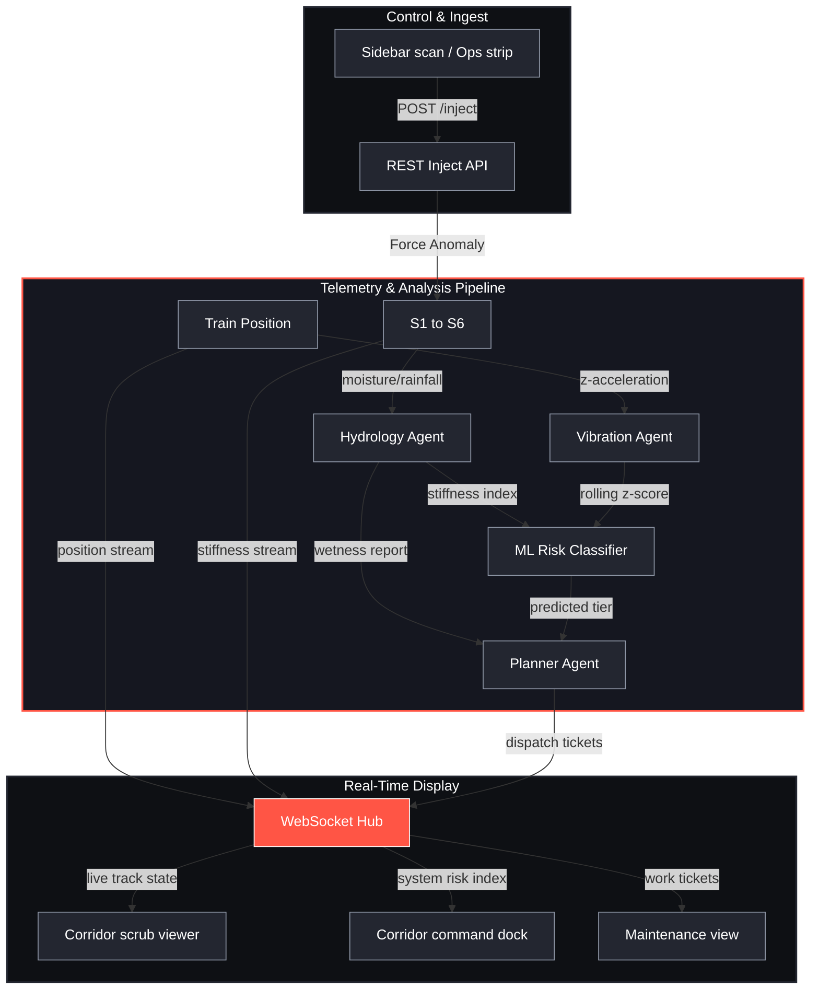

# Bogie Flow

**Others monitor the rail. We monitor the ballast.**


Climate-aware track-bed risk evaluation and agent-based telemetry fusion for railways.

[](https://github.com/Stormynubee/Faraway2026Japan/actions/workflows/ci.yml)
[](https://github.com/Stormynubee/Faraway2026Japan/blob/main/tests/)
[](https://github.com/Stormynubee/Faraway2026Japan/blob/main/src/lib/)
[](https://github.com/Stormynubee/Faraway2026Japan/releases)
[](https://github.com/Stormynubee/Faraway2026Japan/blob/main/LICENSE)
[](https://www.python.org/)
[](https://nodejs.org/)

Bogie Flow is a real-time digital twin monitoring application designed for the FAR AWAY 2026 hackathon under the Railways theme. It fuses environmental climate indicators (rainfall and soil moisture) with train bogie z-axis vibration anomalies to dynamically calculate track-bed structural risk. The application identifies track ballast degradation issues, such as mud pumping, and auto-prioritizes emergency maintenance tickets using a multi-agent workflow integrated with a machine learning classification model.

---

## System Architecture

The following diagram illustrates the flow of simulated telemetry data through the specialized agent systems, the classification model, the WebSocket hub, and the React frontend dashboard.



---

## Core Components

The application is structured into discrete layers of backend agents, machine learning services, and frontend visualization modules.

### Backend Agents
- **Hydrology Agent**: Monitors rain levels and soil moisture content on 6 track segments. Calculates effective ballast stiffness index based on climate factors to evaluate foundation dampness.
- **Vibration Agent**: Evaluates high-frequency acceleration data from the train bogie, calculating rolling z-score metrics to detect physical displacement anomalies.
- **Planner Agent**: Resolves telemetry reports from Hydrology and Vibration agents. Feeds variables to the ML risk classifier to issue maintenance work tickets.

### Machine Learning Engine
- **Gradient Boosting Classifier** (`scikit-learn==1.8.0`): Trained on physics-derived synthetic data (503 samples). Features are `rainfall`, `soil_moisture`, and `vib_z` as a consistent `numpy` matrix at train and predict time. Classifies track risk into OK, P2, and P1.
- **Retrain after dependency changes**: `python -m server.agents.train_risk_model` (writes `server/agents/risk_model.joblib`).

### Frontend Dashboard
- **Corridor scrub viewer**: 64-frame scroll-driven track visualization with segment HUD (S1–S6).
- **Corridor command dock**: Risk gauge, live metrics, and segment strip on Overview / Analysis.
- **Overview ops strip**: One-click monsoon / anomaly inject buttons wired to the REST API.
- **Maintenance view**: Prioritized ticket table and agent decision logs.
- **Climate view**: Environmental stress heatmap, estimated asset longevity, and vibration shift table.
- **Guide coach**: FAB-guided tour and optional Gemini-backed chat (`/api/guide/chat`).
- **Station map modal**: Corridor station reference overlay.

---

## Project Structure

```
Faraway2026Japan/
├── .github/
│   ├── issue_template/
│   │   ├── bug_report.md
│   │   └── feature_request.md
│   ├── workflows/
│   │   ├── ai-review.yml
│   │   ├── ci.yml
│   │   ├── issue-triage.yml
│   │   ├── publish-package.yml
│   │   └── stale.yml
│   ├── CODEOWNERS
│   └── pull_request_template.md
├── docs/
│   ├── PROJECT.md
│   ├── physics.md
│   ├── ws-schema.md
│   ├── SUBMISSION.md
│   └── DEMO_SCRIPT.md
├── server/
│   ├── agents/
│   │   ├── hydrology.py
│   │   ├── vibration.py
│   │   ├── risk_model.py
│   │   ├── train_risk_model.py
│   │   ├── risk_model.joblib
│   │   └── planner.py
│   ├── main.py
│   ├── simulation.py
│   └── models.py
├── src/
│   ├── components/
│   │   ├── AnomalyStream.jsx
│   │   ├── BogieAnalysisPanel.jsx
│   │   ├── BootContinueButton.jsx
│   │   ├── BootFlowMark.jsx
│   │   ├── BootLoader.jsx
│   │   ├── BootTerminal.jsx
│   │   ├── charts/
│   │   │   ├── MoistureSparkline.jsx
│   │   │   └── RainfallBars.jsx
│   │   ├── ClimatePanel.jsx
│   │   ├── CorridorBriefing.jsx
│   │   ├── CorridorCommandDock.jsx
│   │   ├── CorridorScrubRail.jsx
│   │   ├── CorridorScrubViewer.jsx
│   │   ├── guide/
│   │   │   ├── GuideChatPanel.jsx
│   │   │   ├── GuideCoach.jsx
│   │   │   └── GuideSpotlight.jsx
│   │   ├── LogEntry.jsx
│   │   ├── MetricBar.jsx
│   │   ├── OverviewOpsStrip.jsx
│   │   ├── SegmentHudGrid.jsx
│   │   ├── Sidebar.jsx
│   │   ├── StationMapModal.jsx
│   │   ├── TopBar.jsx
│   │   ├── TrackMap.jsx
│   │   └── views/
│   │       ├── AnalysisView.jsx
│   │       ├── ClimateView.jsx
│   │       ├── MaintenanceView.jsx
│   │       └── OverviewView.jsx
│   ├── content/
│   │   ├── guideKnowledge.js
│   │   ├── guideSteps.js
│   │   └── uiCopy.js
│   ├── data/
│   │   └── corridorFrames.js
│   ├── hooks/
│   │   ├── useGuideCoach.js
│   │   └── useWebSocket.js
│   ├── lib/
│   │   ├── api.js
│   │   ├── chartData.js
│   │   ├── config.js
│   │   ├── corridorScrub.js
│   │   ├── guideChat.js
│   │   ├── scrubRail.js
│   │   ├── segmentUtils.js
│   │   ├── wsReconnect.js
│   │   └── wsReducer.js
│   ├── App.jsx
│   └── index.css
├── tests/
│   ├── conftest.py
│   ├── test_api_inject.py
│   ├── test_cors_health.py
│   ├── test_guide.py
│   ├── test_hydrology.py
│   ├── test_inject_anomaly.py
│   ├── test_model_cached.py
│   ├── test_planner.py
│   ├── test_readme_badges.py
│   ├── test_recovery.py
│   ├── test_risk_model.py
│   ├── test_sim_guard.py
│   ├── test_ticket_dedup.py
│   └── test_vibration.py
├── package.json
├── pyproject.toml
├── requirements.txt
└── README.md
```

---

## API and WebSocket Specification

### REST API Endpoints

- `GET /health`: Returns service status and trained ML model parameters.
- `POST /api/inject/monsoon`: Injects rainfall and soil moisture into a segment.
- `POST /api/inject/anomaly`: Simulates physical ballast damage or bogie anomaly.

### WebSocket Messages

The WebSocket server broadcasts updates to frontend clients. Messages conform to the following schema:

| Type | Description | Key Fields |
| :--- | :--- | :--- |
| `state_snapshot` | Current state of all segments, tickets, and logs | `segments`, `train`, `tickets`, `logs` |
| `segment_update` | Telemetry details for a specific track segment | `id`, `risk_index`, `k_effective`, `state`, `color`, `rainfall`, `soil_moisture`, `vib_z`, `az` |
| `train_update` | Train position along current segment | `segment_id`, `progress` |
| `telemetry` | Rolling bogie z-acceleration values (feeds live peak / z-score metrics) | `segment`, `az`, `z_score`, `timestamp` |
| `ticket` | Prioritized maintenance task | `id`, `priority`, `segment`, `reason`, `model_label` |
| `agent_log` | Diagnostic log output from rule-based agents | `agent`, `message`, `timestamp` |

---

## Installation and Quick Start

### Prerequisites
- Python 3.11 or higher
- Node.js 20 or higher

### Fresh clone (< 10 minutes)

```bash
git clone https://github.com/Stormynubee/Faraway2026Japan.git
cd Faraway2026Japan
python -m pip install -r requirements.txt
npm install
npm run dev:all
```

Open **http://localhost:5173** — Vite proxies `/api` and `/ws` to FastAPI on port 8000.

Alternative: `make dev` (same as `npm run dev:all`).

The risk model (`risk_model.joblib`) trains automatically on first API boot if missing. To train manually:

```bash
python -m server.agents.train_risk_model
```

### Production single-URL (local)

```bash
npm run build
npm start
# or: python -m uvicorn server.main:app --host 0.0.0.0 --port 8000
```

Open **http://localhost:8000** — FastAPI serves the built React app, REST API, and WebSocket on one port.

### Docker (deploy)

```bash
docker build -t bogie-flow .
docker run --rm -p 8000:8000 -e PORT=8000 -e ALLOWED_ORIGINS=https://your-app.onrender.com bogie-flow
```

Deploy configs: [render.yaml](render.yaml), [railway.toml](railway.toml). Set `ALLOWED_ORIGINS` to your public URL; optional `GUIDE_AI_API_KEY` for Gemini guide.

### Environment variables

Copy [.env.example](.env.example) to `.env`. Key vars:

| Variable | Purpose |
|--------|---------|
| `ALLOWED_ORIGINS` | CORS (comma-separated); empty defaults to localhost dev origins |
| `GUIDE_AI_API_KEY` | Optional Gemini for corridor guide + ticket Explain |
| `PORT` | HTTP port (default `8000`; set by Render/Railway) |
| `VITE_API_BASE` / `VITE_WS_BASE` | Only needed for split-origin dev; leave empty for proxy/single-URL |

### Verification
Run the backend pytest suite and frontend vitest suite:
```bash
python -m pytest tests/ -q
npm run test
npm run build
```

---

## FAR AWAY 2026 Submission

| Item | Link |
| :--- | :--- |
| Theme | Railways |
| Submission guide | [docs/SUBMISSION.md](docs/SUBMISSION.md) |
| Demo script | [docs/DEMO_SCRIPT.md](docs/DEMO_SCRIPT.md) |
| Full reference | [docs/PROJECT.md](docs/PROJECT.md) |
| Demo video | [assets/demo.mp4](assets/demo.mp4) |

---

## Honesty Box

The simulation uses a physics-informed generator to emit realistic bogie vibration and weather parameters. The GradientBoosting classifier is trained on physics-derived synthetic data (500 samples) to demonstrate multi-modal risk classification. It is not an end-to-end production ML pipeline. The edge node ESP32-S3 and MPU6050 accelerometer integration strategy is fully detailed in the hardware documentation for subsequent field deployment.

---

## License

This project is licensed under the MIT License - see the LICENSE file for details.
